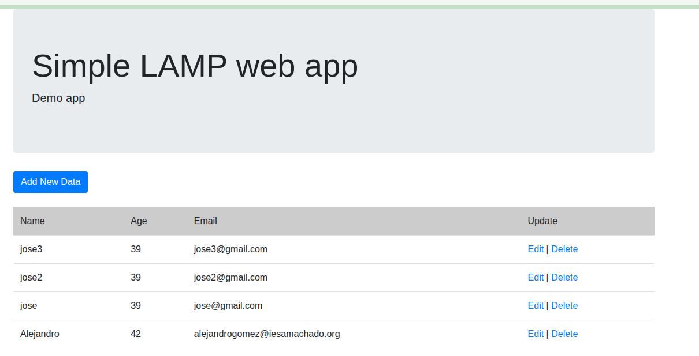

# Práctica: phpMyAdmin y aplicación web sencilla

## Objetivo

Desplegar en una instancia EC2 de AWS una pila LAMP con **MariaDB** y utilizarla para servir phpMyAdmin y una aplicación web sencilla de altas, consultas, modificaciones y borrados.

> En esta práctica, cualquier instrucción de los recursos enlazados que mencione MySQL se aplica a MariaDB. No instales MySQL.

## 1. Preparar la instancia y la pila LAMP

1. Crea una instancia EC2 nueva para esta práctica y llámala **"phpMyAdmin y app sencilla"**. Utiliza la versión más reciente de Ubuntu Server y permite el acceso SSH y HTTP desde el grupo de seguridad. HTTPS no va a hacer falta pero acostúmbrate a ponerlo.
2. Conéctate por SSH y ejecuta el script de instalación de la pila LAMP que preparaste en una actividad anterior. El script debe funcionar en esta instancia e instalar Apache, MariaDB y PHP, incluido el soporte de PHP para conectarse a MariaDB.
3. Comprueba que Apache, PHP y MariaDB funcionan correctamente siguiendo las indicaciones de [Instalación de un servidor web LAMP en Debian](02-instalar-lamp-debian.md). No continúes hasta resolver cualquier error: tanto phpMyAdmin como la aplicación dependen de esta pila.


## 2. Instalar y comprobar phpMyAdmin

Consulta el documento original: [Instalar phpMyAdmin con `apt`, en la documentación de la pila LAMP](https://josejuansanchez.org/iaw/practica-01-01-teoria/index.html#otras-herramientas-relacionadas-con-la-pila-lamp).

Aquí tienes un resumen de los 4 pasos del enlace anterior que son los que tienes que seguir.

1. Instala phpMyAdmin y los módulos PHP que necesita:

   ```bash
   sudo apt install phpmyadmin php-mbstring php-zip php-gd php-json php-curl -y
   ```

2. Cuando el instalador pregunte qué servidor web debe configurar, selecciona `apache2` con la barra espaciadora y confirma.
3. Confirma que quieres utilizar `dbconfig-common` para configurar la base de datos de phpMyAdmin.
4. Introduce y confirma la contraseña que solicite el instalador para phpMyAdmin. Es una contraseña de configuración del paquete; para iniciar sesión en la interfaz usarás una cuenta de MariaDB.

En las preguntas del instalador, utiliza MariaDB como gestor de bases de datos. Al terminar, abre `http://IP_PUBLICA/phpmyadmin`, sustituyendo `IP_PUBLICA` por la IPv4 pública de la instancia, e inicia sesión con un usuario de MariaDB. Comprueba que aparece la interfaz y que puedes consultar las bases de datos.

## 3. Desplegar la aplicación web

La aplicación y sus ficheros están en el [repositorio iaw-practica-lamp](https://github.com/josejuansanchez/iaw-practica-lamp). Descárgalo en la instancia y localiza sus directorios `src` y `db`. Automatiza estos pasos con un script propio y comprueba que termina correctamente.

1. **Crea la base de datos y el usuario de la aplicación.** El fichero `db/database.sql` crea la tabla `users`, pero las instrucciones para crear la base de datos están comentadas. Por eso, primero crea una base de datos llamada `lamp_db` y un usuario local con permisos sobre ella. No configures la aplicación para conectarse como `root`. Puedes hacerlo desde la consola de MariaDB:

   ```sql
   CREATE DATABASE lamp_db CHARACTER SET utf8mb4;
   CREATE USER 'app_user'@'localhost' IDENTIFIED BY 'CAMBIA_ESTA_CONTRASENA';
   GRANT ALL PRIVILEGES ON lamp_db.* TO 'app_user'@'localhost';
   EXIT;
   ```

   Para abrir la consola, ejecuta `sudo mariadb`. Sustituye la contraseña de ejemplo por una propia y utiliza ese mismo valor en `config.php`.
2. **Importa los datos iniciales.** Desde el directorio raíz del repositorio, ejecuta el fichero SQL sobre la base de datos que acabas de crear:

   ```bash
   sudo mariadb lamp_db < db/database.sql
   ```

   Después, comprueba en phpMyAdmin que `lamp_db` contiene la tabla `users`.
3. **Publica los ficheros PHP.** Copia el contenido de `src` al `DocumentRoot` de Apache, normalmente `/var/www/html`. La aplicación debe quedar accesible desde la raíz del sitio y no dentro de un directorio adicional creado al copiar el repositorio completo.
4. **Configura la conexión.** Edita `config.php` en el directorio publicado y establece el host `localhost`, el nombre `lamp_db` y el usuario y contraseña que creaste. Estos valores tienen que coincidir con la base de datos y el usuario de MariaDB.
5. **Prueba la aplicación.** Abre `http://IP_PUBLICA/` y verifica que carga sin errores y permite consultar y gestionar registros. Si aparece un error de conexión, revisa primero los valores de `config.php`, los permisos del usuario y que la tabla se haya importado.

La imagen siguiente es una referencia visual de la aplicación funcionando; no sustituye las capturas que se piden como entregables.



## Entregables

- Una captura de pantalla donde se vea phpMyAdmin funcionando.
- Una captura de pantalla donde se vea la aplicación funcionando.